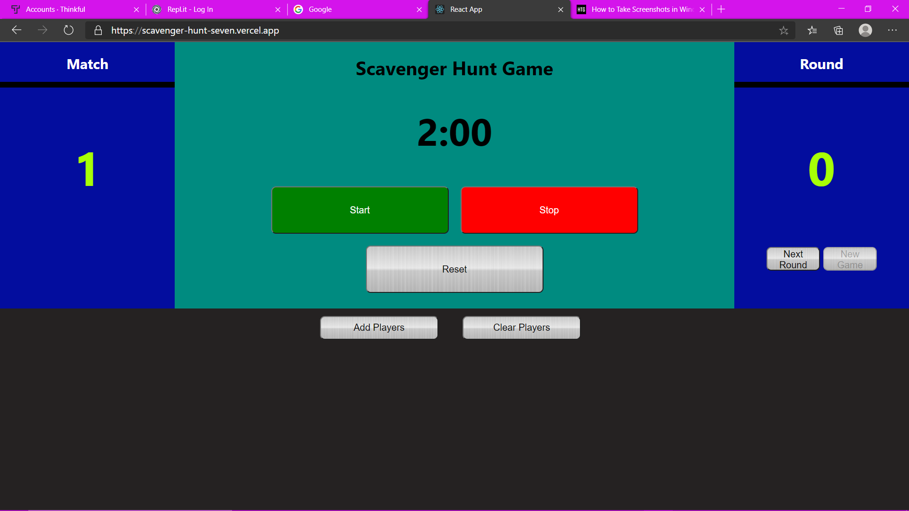
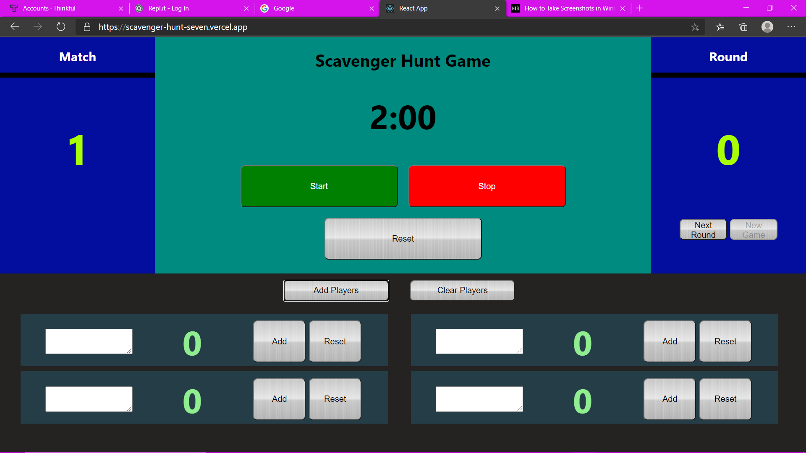

## Scavenger Hunt Game
This is an app to play the vertual scavenger hunt.
## Live
https://scavenger-hunt-seven.vercel.app

## Scavenger Hunt Rules

A virtual scavenger hunt is where you find household items based on a list.
PLAYERS:
1 to EVERYONE can participate in a very one for themselves play.
TO PLAY:
There is a total of 3 matches to be played.  Each Match consists of 5 individual rounds with each round lasting 2 minutes.  At the end of each Match there is a 3-minute break to tally point or get a drink of water.
When the round is played the round official will list of three random items for a player to find.  The player must then find the item and bring back to their spot.  If an item is too big to carry a photo can be taken.  The photo must have the player present next to the item in the photo. 
BONUS ROUNDS:
Bonus rounds are played on even number rounds (round 2 and 4), were a fourth Item can be in play that is unique or rare in availability.  
POINTS:
Items that are found are worth 1 Point each with the bonus item being valued at 3 or 5 points based on the round official’s judgment on rarity of item.  
FINAL:
At the end of the 3 Matches, the points will be totaled, and a winner will be announced.  If there is a tie, the players in the tie will be able to compete in a BONUS ROUND event see BONUS round rules above.

## Photos

